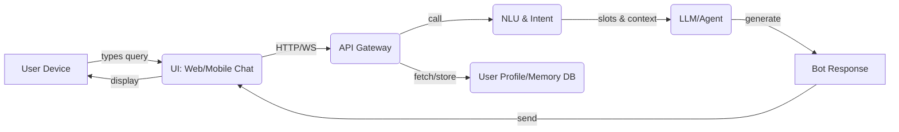
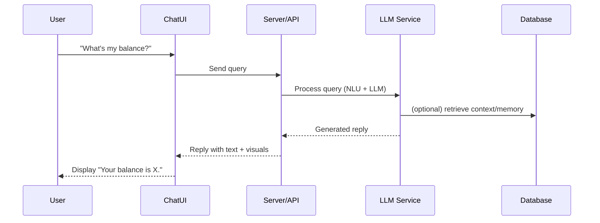

# Executive Summary  
Modern personal-finance chatbots (like Cleo or OpenAI’s new finance mode) use **clear visual summaries** (cards, charts, highlights) and **conversational cues** (microcopy, humor, guidance) to present data in an intuitive way. They follow fintech UX heuristics: disclosing information progressively, avoiding jargon, and signaling security to build trust. Personalization is achieved via **user modeling** and **context management**: bots detect user intent, track conversation state and memory (often via embeddings/RAG) and adapt tone/persona to user profiles. Architecturally, options range from pure client-server to edge or hybrid deployments; all layers can rely on open-source tools (e.g. React/Flutter for UI, FastAPI/Rasa for backend, Hugging Face models and vector DBs for NLP, Kubernetes/Prometheus for orchestration). 

Key trade-offs involve model size vs. latency and cost: smaller open LLMs (7–13B parameters) require ~14GB VRAM (FP16) but can be quantized to ~3–4GB. Caching, batching, quantization, and autoscaling are critical to support ~50–100 concurrent users with low p95 latency (e.g. Cleo’s pipeline targets <500ms). An implementation plan should outline a privacy-compliant data pipeline, performance metrics, and A/B tests. The following report details data presentation patterns, personalization methods, architecture options, open-source stacks, and reliability strategies, with comparative tables and mermaid diagrams.

## Data Representation Patterns in PFM Chatbots  
Financial chatbots present data using **visual summaries** and contextual highlights. For example, Cleo shows *personalized spend summaries as swipeable cards*, enabling users to scan highlights quickly. Similarly, Bank of America’s Erica chat shows *mini charts and transaction cards* inline to make data scannable. ChatGPT’s finance mode can display *spend-by-category charts* to help users visualize budgets. By showing one chart or card at a time, bots implement **progressive disclosure**, revealing deeper details only on demand.  

 *Figure: Example chatbot dashboard showing spending breakdown (from ChatGPT’s finance feature)*. Clear visuals (bar/pie charts, progress bars) guide decision-making, with values and timeframes labeled for transparency. Complementing visuals, bots use **microcopy** and tone to ease understanding: Cleo, for instance, uses witty copy to motivate users without jargon. UI cues like animations or color highlights emphasize successes (e.g. “You saved $X this week!”) or warnings (e.g. overspending) to draw attention. 

Design heuristics emphasize **clarity and trust**. Fintech UX guidelines stress simplicity: single concept per message, plain language, and explicit security cues. Chatbots should show system status (e.g. “Analyzing your spending…”) to manage expectations. They must make clear they are AI (to avoid misplaced trust) and keep the UI consistent with familiar chat metaphors (bubbles, buttons). In short, effective PFM bots combine adaptive UI elements (cards, charts, quick-replies) with empathetic copy and *prompted options* to guide the user, reducing cognitive load and reinforcing user control.  

**Decision rules** about what to show when involve context and relevance. For example, Cleo’s system “saves what matters” from each session and only recalls it in open-ended contexts (not on simple queries like “balance?”) to avoid irrelevant reminders. Likewise, bots often monitor transactions for anomalies or goals: if a spending alert or budget milestone is reached, the bot may proactively display a chart or card highlighting it. These triggers (user questions, detected anomalies, or time-based check-ins) govern which data (balances, budgets, forecasts) is shown, ensuring the user sees *actionable insights* rather than raw logs.

## Personalization and Response Generation  
Chatbots personalize responses through **user profiling and context management**. Early steps include *segmentation* and *modeling*: analyzing user data (transaction history, demographics) to infer needs. In practice, AI models cluster users or apply rules (e.g. student vs. professional budgets) and fine-tune language/style accordingly. At runtime, **intent detection and slot-filling** ensure the bot understands queries. For example, to set up a payment, the bot must identify intent (“transfer money”) and fill slots (recipient, amount, date) via follow-up prompts. Rasa-like NLU pipelines or LLM classifiers are commonly used. Intent classification can be rule-based or ML-based, while slot extraction may use sequence models or simply prompt the user.  

**Context and memory** are key for a tailored feel. Modern bots use *retrieval-augmented generation (RAG)*: conversation snippets are summarized and embedded, then retrieved later when relevant. Cleo’s pipeline, for instance, summarizes each session and stores vector embeddings. When a new conversation triggers related topics (e.g. “How can I save more?”), similar past insights are fetched to inform the answer. Context state (recent messages, dialog history, user profile) is held on the server or in a vector DB so that each reply can refer back. As one heuristic notes, the conversation itself should act as a memory aid, so good bots restate collected info (“You have two savings goals: rent and emergency fund. Which would you like to discuss?”).

**Tone and style adaptation**: The bot’s “persona” should match user expectations. In finance chatbots, a steady, helpful tone earns trust, whereas playful banter (Cleo’s trademark sass) can motivate without alienating. Research shows that empathetic framing and addressing users’ emotional state is vital for engagement. Bot frameworks can adapt style by selecting response templates or fine-tuning LLM prompts with persona cues. For example, when user’s tone is frustrated, the bot might adopt a more reassuring style and offer simpler solutions. 

**NLG Templates vs. Neural Generation**: Traditional bots often relied on fixed templates (filling slots into pre-written sentences). Templates guarantee grammatical output but can feel robotic and require a large template library. In contrast, neural LLMs (GPT, Llama, etc.) generate free-form text that can be more natural and context-aware. Many systems use a hybrid approach: they may have structured templates for predictable system messages (“Sure, I can do that. How much to transfer?”) and reserve neural generation for advice or summaries. Using LLMs allows dynamic explanations (“According to your spending pattern, reducing dining out could help.”) but requires safeguards (to prevent hallucinations). Open-source NLG libraries (e.g. Hugging Face Transformers, LangChain) can be combined with domain-specific prompt libraries.

**Explainability**: Finance bots must often justify recommendations. One approach is RAG: by retrieving actual transactions or policy documents, the bot can cite facts (“Last month you spent $X on groceries, which is 20% above your norm. Cutting that by 5% saves $Y.”) rather than faking facts. Designing answers with “because…” clauses (e.g. “Because your balance dropped, you should…”), or offering on-demand details (“Do you want to know how I calculated this?”) can improve trust. Tools like knowledge graphs or annotated templates can help the bot expose reasoning steps. While formal citations are rare in chat, ensuring the bot logs sources internally (and showing glimpses of reasoning when asked) can aid transparency.

## System Architecture (Client-Server, Edge, Hybrid)  
Various architectures can host the chatbot on the assumed Antigravity platform:

- **Client-Server**: The UI (mobile/web) collects user input and sends it to backend servers for processing. The backend runs the NLU and LLM inference (possibly on GPUs), consults databases (user profile, vector DB memory), and returns responses. This model centralizes compute but requires a reliable network. Antigravity would orchestrate the backend containers (e.g. Kubernetes pods) and route requests from clients. This is simplest to implement using APIs (REST/GraphQL).

- **Edge Inference**: Some processing runs on the device. For example, initial intent classification or embeddings might run locally (using TensorFlow Lite, ONNX, or mobile LLMs like Mistral-Instant 7B). The device could also cache recent data. Only heavier tasks (e.g. large LLM generation) go to server. This reduces latency and server load but complicates deployment (need to package models for iOS/Android, manage device capabilities). If Antigravity allows packaging edge services (e.g. via WebAssembly or sidecar containers), it can push models to clients. 

- **Hybrid**: A mix of both. For instance, use a lightweight local model to handle easy Q&A and only send “hard” queries (or those needing new data) to cloud. Another hybrid pattern: the cloud periodically pushes summarized “memory” to the app so the local agent can give partially personalized answers offline. Antigravity could manage a split system where a microservice on-device syncs with the central server. 

Each approach trades off **latency vs. resource use**. Pure server solves device limitations but may incur network delay; edge inference cuts round-trips but needs robust on-device ML support. For 50–100 concurrent users, a client-server setup with autoscaling can be effective (e.g. Kubernetes pods spinning up more replicas as load grows). The diagrams below illustrate a typical client-server flow and a possible data-memory pipeline.

## Open-Source Tech Stack Options  
*Frontend:*  
- **Web:** [React](https://reactjs.org/) (MIT) or [Vue.js](https://vuejs.org/) (MIT) for flexible chat UI. Libraries like [BotUI](https://docs.botui.org/) (MIT) or [Microsoft Bot Framework Web Chat](https://github.com/microsoft/BotFramework-WebChat, MIT) provide prebuilt chat widgets.  
- **Mobile:** [React Native](https://reactnative.dev/) (MIT) or [Flutter](https://flutter.dev/) (BSD) for cross-platform apps. Both support embedding chat components and handling offline caching.

*Backend:*  
- **Frameworks:** [Node.js/Express](https://expressjs.com/) (MIT) or [FastAPI](https://fastapi.tiangolo.com/) (MIT) for REST/GraphQL APIs. [Rasa](https://rasa.com/) (Apache 2.0) or [Botpress](https://botpress.com/) (AGPL-3.0) can manage dialogues and NLU flows.  
- **Databases:** PostgreSQL (PostgreSQL License) or MySQL (GPL) for user data; [Redis](https://redis.io/) (BSD) for fast caching; vector DBs like [Qdrant](https://qdrant.tech/) (Apache 2.0) or [Milvus](https://milvus.io/) (Apache 2.0) for embeddings. 

*ML/NLP:*  
- **LLMs:** Open models like [Llama 3](https://huggingface.co/meta-llama/Llama-3-8b-hf) (Llama license), [Mistral](https://huggingface.co/mistralai) (Apache 2.0), [Falcon](https://huggingface.co/tiiuae) (Apache 2.0) are available on Hugging Face (Transformers lib, Apache 2.0). Smaller fine-tuned models (7B–13B) reduce hardware needs.  
- **Embeddings:** [Sentence Transformers](https://www.sbert.net/) (MIT) for user/context vectors. Tools like [Haystack](https://github.com/deepset-ai/haystack, Apache 2.0) or [LangChain](https://github.com/langchain-ai/langchain, MIT) support RAG pipelines.  
- **Vector DB:** [FAISS](https://github.com/facebookresearch/faiss, MIT) or [Annoy](https://github.com/spotify/annoy, Apache 2.0) for similarity search.  
- **Monitoring & Analytics:** [Prometheus](https://prometheus.io/) (Apache 2.0) for metrics, [Grafana](https://grafana.com/) (AGPL-3.0) for dashboards, [Elastic Stack](https://elastic.co/) (Apache 2.0) or [ClickHouse](https://clickhouse.com/) (Apache 2.0) for logging/analytics.  

*Orchestration:*  
- **Platform:** [Kubernetes](https://kubernetes.io/) (Apache 2.0) can run containers for the backend and ML services, with [KServe](https://kserve.github.io/) (Apache 2.0) or [KFServing](https://github.com/kubeflow/kfserving) for serving models. [Docker Compose](https://docker.com/) (Apache 2.0) for simpler setups.  
- **Workflow/Memory Orchestration:** Tools like [Dagster](https://dagster.io/) (Apache 2.0) or [Airflow](https://airflow.apache.org/) (Apache 2.0) can define data pipelines (ETL, memory summarization).  

**Table: Example tech stack options**  

| Layer      | Option                       | License        | Notes (trade-offs)                   |
|:-----------|:-----------------------------|:--------------|:-------------------------------------|
| Frontend UI| React (web)                  | MIT           | Flexible, large ecosystem; requires JS knowledge. |
|            | Vue.js (web)                 | MIT           | Lightweight, easy to integrate; smaller community. |
|            | Flutter (mobile)             | BSD-like      | Fast cross-platform dev; larger binary size. |
|            | React Native (mobile)        | MIT           | Leverages web skills; native feel; may need bridges. |
| Backend    | FastAPI (Python)             | MIT           | Async, high-performance; Python ML ecosystem. |
|            | Express (Node.js)            | MIT           | Simple, event-driven; JS throughout stack. |
|            | Spring Boot (Java)           | Apache 2.0    | Robust, strong typing; heavier memory footprint. |
| Chatbot NLU| Rasa (Python)                | Apache 2.0    | Open-source bot framework; needs training data. |
|            | Botpress                     | AGPL-3.0      | GUI chatbot builder; AGPL license.  |
| ML/NLP     | Hugging Face Transformers    | Apache 2.0    | SOTA model hub; many model choices.  |
|            | TensorFlow / PyTorch         | Apache 2.0    | For custom ML models; steep learning curve. |
| Embedding  | Sentence Transformers        | MIT           | Pretrained encoders for RAG.        |
|            | Annoy / FAISS                | MIT/Apache 2.0| Fast vector search; on-disk support. |
| Orchestration| Kubernetes                 | Apache 2.0    | Scalable container management; complex setup. |
|            | Docker Compose               | Apache 2.0    | Simple multi-container apps; limited scaling. |
| Monitoring | Prometheus                   | Apache 2.0    | Metrics collection; alerts.         |
|            | ELK Stack (Elasticsearch)    | Apache 2.0    | Searchable logs; resource intensive. |
|            | Grafana                      | AGPL v3       | Custom dashboards; AGPL license.   |

## Scalability, Latency, and Reliability Strategies  
To serve ~50–100 concurrent users with responsive chat, implement several optimizations:  

- **Model Sizing & Pruning:** Use models small enough to run in acceptable time. A 7–13B parameter model may require ~14GB GPU RAM in FP16; quantizing to 4 or 8 bits can cut memory to ~3–7GB. Pruning or using distilled models further reduces size (at accuracy cost). For example, the Qwen-3-8B model (8B) was shown to match larger LLMs in finance tasks while costing 80% less.  

- **Batching & Pipelining:** Process multiple requests in batches (where latency allows) to improve GPU utilization. Use async request handling to overlap IO and computation. Model inference libraries like [vLLM](https://vllm.ai/) or Triton can auto-batch.  

- **Caching:** Store and reuse expensive results. For example, cache recent user queries and answers, and common RAG results (e.g. user goals). Caching reduces redundant LLM calls for similar queries. Similarly, cache embedding vectors for known phrases to speed up retrieval.  

- **Autoscaling:** Deploy the server on a platform (like Kubernetes) with HPA (Horizontal Pod Autoscaler). Scale pods based on custom metrics (CPU/GPU utilization, queue length) to handle peak loads. This avoids over-provisioning while ensuring capacity during spikes.  

- **Quantization & Acceleration:** Use 8-bit/4-bit quantization (with libraries like [bitsandbytes](https://github.com/facebookresearch/bitsandbytes)) to enable faster inference on GPU/CPU with minimal quality loss. Use TensorRT or ONNX Runtime for acceleration. If using GPUs, enable mixed-precision to double throughput.  

- **Graceful Degradation:** In case of overload or failures, the bot can degrade features: e.g. switch from generative mode to rule-based fallback, or reduce response length. Pre-build templates or FAQs to serve common queries offline. Provide canned acknowledgment (“Sorry, service is busy, try again in a moment”) as needed.  

- **Offline-first (client-side):** For mobile clients, cache key data (balances, recent conversation) for quick access even if offline. Sync with server when online. This reduces requests and handles intermittent connectivity.  

- **Circuit Breakers & Timeouts:** Implement circuit breakers for external API calls (e.g. payment APIs) and limits on LLM queries. If a service fails or is slow, the bot should handle timeouts gracefully (e.g. “I’m having trouble fetching that right now.”).  

- **Testing & Monitoring:** Continuously test under load. Use stress tests (e.g. Locust, k6) to simulate 100 users. Monitor p95 latency (Cleo aimed <500ms for its memory retrieval). Track error rates, GPU utilization, and adjust. Automated alerts on anomalies (e.g. increased token generation time) help maintain reliability.  

## Implementation Plan, Metrics, and Rollout  
**Data Pipeline:** Securely ingest user financial data (e.g. via Plaid or manual entry). Normalize transaction records, categorize spending, and store in encrypted DBs. Summarize daily/weekly and feed into the memory index (vector DB). Use strict access controls and anonymization where possible.  

**Privacy/Security:** Since financial PII is involved, follow privacy-by-design. Encrypt data at rest and in transit. Use OAuth2 and multi-factor authentication for account linking. Provide transparency (users see what data is stored) and allow deletion of memory per user request. Audit all data flows.  

**Evaluation Metrics:** Beyond accuracy and intent recognition, track: user satisfaction (CSAT surveys), goal completion rate (successful tasks), personalization scores (e.g. responses rated helpfulness by A/B tests), and technical metrics (API latency, LLM confidence scores). For A/B testing, compare bot variants on key outcomes: engagement time, NPS, and drop-off rates.  

**A/B Testing & Rollout:** Start with an internal beta to fine-tune tone and correctness. Use feature flags to gradually enable the bot. In A/B tests, randomize users into different persona styles or feature sets, measuring which yields higher satisfaction and task success. Incrementally release to more users as metrics meet targets.  

**Iterative Feedback:** Log unanswered questions or low-confidence responses for review. Continuously retrain NLU or adjust prompts. Update memory filters to avoid surfacing outdated or sensitive info. Conduct periodic UX audits to ensure clarity and trust (e.g. compliance with Nielsen heuristics).  

## Trade-offs, Antigravity Integration, and Footprint  
Different stacks/models involve trade-offs in complexity, cost, and resource needs. Below are example comparisons:

| Option | Frontend | Backend/ML | Personalization | Trade-offs | Antigravity Integration | Est. Resources (50–100 users) |
|---|---|---|---|---|---|---|
| **A: High-power Server** | Web UI (React) | Python API + HuggingFace Llama 13B + Qdrant | Full RAG memory, fine-tuned prompts | Very flexible, high quality responses; high cost (GPU needed), complex scaling. | Deploy as Docker/K8s on Antigravity; GPU pods with HPA; orchestrate pipeline (ETL, retrieval). | ~1 GPU (16–24GB) with FP16 (~14GB) serving ~50 u/s; 8 CPU cores; 32GB RAM. |
| **B: Hybrid Mobile** | Mobile App (Flutter) | Node.js microservices + locally embedded Mistral-7B + cloud LLM fallback | Local intent NLU, cloud handle heavy queries | Lower latency for simple queries; more dev work (mobile ML); handles offline cases. | Antigravity manages local model updates and serverless functions; syncs user memory. | Device: mobile CPU (~2–4GB+), Server: 1 small GPU (~8GB) + CPU. Lower concurrency on server due to client-side load. |
| **C: Template/Rules Fallback** | Any client | Rasa / Botpress + small GPT-Neo 2.7B | Simple profiles (age group), rule-based flows | Easiest to implement; predictable; limited personalization, less fluent replies. | Antigravity runs Rasa servers; scale Rasa actions; no GPU needed (small model on CPU). | All-CPU: 4 cores, 8GB RAM. Handles ~50 users with fast intent routing; LLM calls rare. |
| **D: Enterprise Cloud API** | Web/Mobile (UI Toolkit) | Hosted LLMs (OpenAI/GPT-4o) via API + RAG on Vectordb | Sophisticated personalization via cloud AI services | Quick setup, high accuracy; costs per call; vendor lock-in; data shared externally. | Antigravity invokes external APIs (need API keys); minimal infra to manage. | Minimal local footprint; scale via API; GPU not required; network latency involved. |

In **Option A**, running a 13B model on GPUs (e.g. Nvidia A100 or RTX 4090) provides strong capability but requires ~14–24GB VRAM and multiple CPUs to handle pre/post-processing. Batching can serve dozens of requests per GPU, but must autoscale pods for peaks. Antigravity would coordinate GPU instances and attach the Qdrant vector store.  

**Option B** offloads work to devices: each app might do intent/slot tasks locally (TorchScript or TF Lite models ~100–200MB). The server still runs a moderate LLM for complex reasoning. This reduces server cost but means each device needs ~2–4GB free RAM for the local model. Updates must be pushed to clients. Antigravity might deploy models as over-the-air updates.  

**Option C** uses rule templates: requires minimal compute (multi-core CPU, ~8GB RAM) and no GPUs. It’s less flexible (user queries outside the decision tree fail) but ensures consistent, fast replies. Integration is simple (stateless servers with few dependencies). Antigravity could run multiple stateless containers behind a load balancer.  

**Option D** relies on external AI (e.g. OpenAI’s GPT-4o APIs). There is virtually no GPU footprint on our side, but we incur API costs and possible latency. Data privacy concerns arise (though budgets/goals can be encrypted). Antigravity would need only lightweight services for orchestration and caching. 

Each approach has trade-offs in **cost vs. control** and **quality vs. complexity**. Smaller open models (7–8B) on CPU can serve basic tasks cheaply, while larger models or cloud APIs deliver better responses but at higher resource cost. Antigravity’s role is to connect these components: e.g. launching containers for the model service, routing device messages, and scaling based on load. 

**Summary:** By combining smart UX (cards, charts, microcopy) with AI personalization (contextual memory, friendly tone) and robust engineering (autoscaling, caching, privacy safeguards), a Cleo-like PFM chatbot can offer clear, trustworthy guidance. The recommended tech stack uses proven open-source tools (React/Flutter, FastAPI/Node, HuggingFace models, Kubernetes, Prometheus). The implementation should be iterative, metrics-driven, and privacy-first, ensuring high clarity, personalization, and reliability for end users. 

