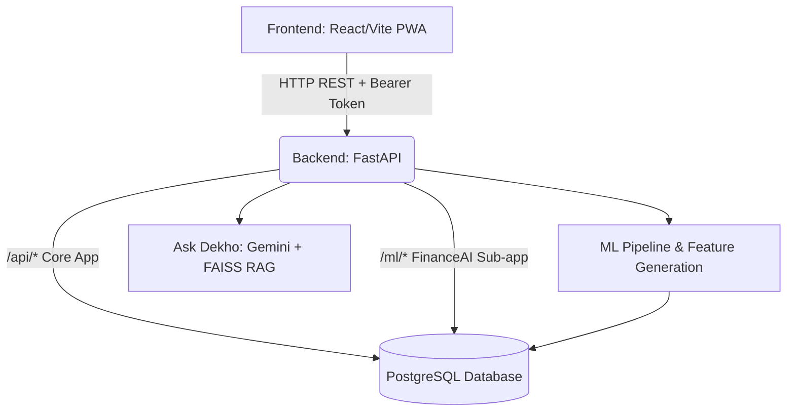

# Dekho: Comprehensive Application Overview

## 1. What is Dekho?
**Dekho** is an AI-powered, habit-first personal finance companion designed primarily for the Indian context. It operates as a mobile-first Progressive Web App (PWA) with a focus on a "calm editorial aesthetic" (warm cream surfaces, generous spacing, soft shadows) rather than the dense, overwhelming interfaces typical of traditional banking dashboards. 

Dekho is built around a **behavior-first philosophy**. Instead of just tracking numbers, it aims to help users build better financial habits through personalized, AI-driven insights and a highly interactive conversational interface called **"Ask Dekho"**.

## 2. Core Features
*   **Automated Transaction Ingestion:** Users can upload bank statements (PDF/CSV) or paste SMS transaction alerts directly into the app.
*   **ML-Powered Categorization:** A custom Machine Learning pipeline automatically parses raw SMS text, extracts relevant details (amount, merchant, date, UPI/VPA), and assigns the transaction to a category (e.g., Essentials, Lifestyle).
*   **Dynamic Financial Dashboard:** Offers a rich visual representation of finances, including spending heatmaps, monthly pulse/budget tracking, savings goals, and asset tracking.
*   **"Ask Dekho" AI Chatbot:** The primary conversational experience. It uses Gemini AI (or local Ollama models) combined with FAISS (Vector Search) for Retrieval-Augmented Generation (RAG). It can answer questions about the user's specific financial situation, provide educational insights, and even take actions like creating new savings goals directly from the chat.
*   **Continuous Learning:** The app learns from user corrections. If the ML miscategorizes a transaction, the user's correction updates a personal `merchant_mappings` table. Future transactions from that merchant are automatically categorized correctly for that specific user.
*   **Behavioral Insights (Monthly Wrap):** Generates Spotify-Wrapped-style monthly summaries highlighting spending spikes, recurring subscriptions, and savings rates.

## 3. Technology Stack & Architecture

Dekho utilizes a robust three-tier architecture, heavily separating raw data from the ML feature layer.

| Layer | Technologies Used |
| :--- | :--- |
| **Frontend (UI/UX)** | React, Vite, TypeScript, Zustand (State Management), TanStack React Query, Framer Motion (Animations) |
| **Backend (API & Core)** | Python, FastAPI, SQLAlchemy (Async ORM), Pydantic v2 |
| **Database** | Transitioning from SQLite (MVP) to **PostgreSQL (Neon Cloud)** |
| **AI & ML Layer** | Gemini API / Ollama (LLM Runtime), SentenceTransformers (Embeddings), FAISS (Vector DB for RAG), TF-IDF + Rule-based models (Categorization) |
| **Background Processing**| Celery + Redis (for heavy parsing and ML inference) |
| **Data Parsing** | Pandas, python-docx, pdfplumber |

### System Architecture Diagram

## 4. How We Built It: The End-to-End Workflow

The application is built on a strict separation of concerns: **Raw Data → Structured Data → Feature Layer → ML Models → Outputs.**

1.  **Data Ingestion:** The user uploads a CSV/PDF or pastes an SMS string (e.g., `"Your A/C X1234 is debited by INR 500 at ZOMATO."`).
2.  **Parsing & Extraction:** The backend `SMSParser` extracts key variables (Amount: 500, Merchant: Zomato, Type: Debit).
3.  **ML Categorization (HybridClassifier):**
    *   The system first checks the user's `merchant_mappings` (has the user corrected Zomato before?).
    *   If not found, it falls back to the ML model (TF-IDF + rules) to predict the category.
    *   A `ConfidenceEngine` scores the prediction, boosting it for known merchants and lowering it for ambiguous inputs (like mixed baskets or P2P transfers).
4.  **Storage in Canonical DB:** The parsed, standardized transaction is saved to the database. **Critical Rule:** The DB is designed around accurate financial storage, not around ML model requirements.
5.  **Feature Generation & Insights:** The system calculates reusable metrics (monthly spend, category ratios). The AI generates behavioral insights (e.g., detecting a new recurring subscription).
6.  **Serving the UI & Chatbot:** The React frontend consumes these APIs to render the dashboard. When using "Ask Dekho", the backend pulls the user's global context (budgets, recent spends) and passes it to the LLM (Gemini) along with financial knowledge base articles via FAISS, ensuring hyper-personalized, accurate chat responses.

## 5. Database Design & Security

Dekho is currently migrating from local SQLite prototypes to a production-ready **PostgreSQL database hosted on Neon Cloud**. 

**Canonical Schema Highlights (16 Core Tables):**
*   **`users`:** Master identity table.
*   **`transactions`:** The core financial ledger, linking back to the user and raw SMS.
*   **`merchant_mappings` & `feedback_logs`:** For per-user ML personalization and retraining triggers.
*   **`budgets`, `savings_goals`, `recurring_expenses`, `wallet_floats`:** For tracking specific financial behaviors.

**Security & Multi-Tenant Isolation:**
*   **JWT Authentication:** Replacing local `user_id` storage with secure JSON Web Tokens.
*   **Strict User Isolation:** Every table containing user data has a `user_id REFERENCES users(id)` foreign key. Every database query strictly enforces `WHERE user_id = :authenticated_user_id` to ensure users can never access each other's financial data.
*   **Secure Models:** ML models request specific features through a service layer; they do not have unrestricted database access.

## 6. Current Status & Roadmap

Dekho is transitioning from a highly functional local prototype to a scalable, cloud-deployed mobile application. 

**Immediate Next Steps:**
1.  **PostgreSQL Migration (In Progress):** Merging the split SQLite databases (`dekho.db` and `financeai.db`) into a single Neon Cloud PostgreSQL instance.
2.  **JWT Implementation:** Securing all endpoints with proper token-based authentication.
3.  **Mobile Deployment:** Wrapping the PWA for deployment to mobile devices (via Capacitor/React Native) or setting up secure network tunneling for on-device testing.
4.  **UI Refinement:** Continuing to polish the dashboard, consolidating the interface, and refining dynamic AI insights to replace static mock data.
